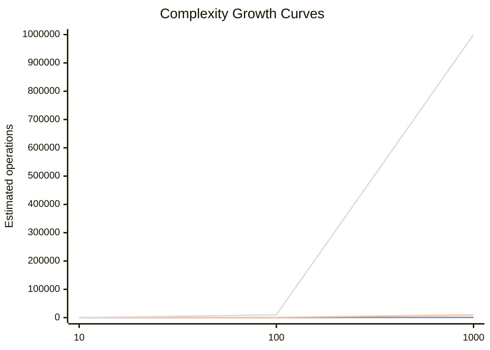

# C++ Algorithms Guide

This document explains the new C++ files and summarizes their time complexity.

## File Mapping (Old -> New)

- `Factorial.java` -> `factorial.cpp`
- `Fibonacci.java` -> `fibonacci.cpp`
- `Binary Search.java` -> `binary_search.cpp`
- `Bubble Sort.java` -> `bubble_sort.cpp`
- `Insertion Sort.java` -> `insertion_sort.cpp`
- `Selection Sort.java` -> `selection_sort.cpp`
- `Merge Sort.java` -> `merge_sort.cpp`
- `Quick Sort.java` -> `quick_sort.cpp`
- `LinearSearch.java` -> `linear_search.cpp`
- `Insertion.java` -> `insertion.cpp` (same logic as linear search)
- `0:1_knapsack.py` -> `knapsack_01.cpp`
- `bellmann_ford.py` -> `bellmann_ford.cpp`
- `Djikstra.py` -> `djikstra.cpp`
- `LCS.py` -> `lcs.cpp`
- `Matrix Chain Multiplication.py` -> `matrix_chain_multiplication.cpp`

## Topics Added (Not originally present)

- `fractional_knapsack.cpp`
- `n_queen.cpp`
- `sum_of_subsets.cpp`
- `naive_string_matching.cpp`
- `activity_selection.cpp`

## Code Explanations

### Factorial (`factorial.cpp`)

- Iterative method multiplies values from `1` to `n`.
- Recursive method uses `n * fact(n-1)` with base case `n <= 1`.
- Demonstrates both styles and counts steps.

### Fibonacci (`fibonacci.cpp`)

- Iterative version builds the sequence in linear time.
- Recursive version computes the `n`th term with repeated subproblems.

### Binary Search (`binary_search.cpp`)

- Works only on sorted arrays.
- Repeatedly halves the search interval using middle index.
- Includes iterative and recursive implementations.

### Bubble Sort (`bubble_sort.cpp`)

- Adjacent elements are swapped if out of order.
- Uses an optimization: if no swap in a pass, stop early.

### Insertion Sort (`insertion_sort.cpp`)

- Builds a sorted prefix.
- Inserts current element into correct position by shifting larger elements.

### Selection Sort (`selection_sort.cpp`)

- Finds the minimum in unsorted part and places it at the front.
- Number of comparisons stays quadratic in all cases.

### Merge Sort (`merge_sort.cpp`)

- Divide and conquer.
- Recursively sorts halves, then merges sorted halves.
- Always `O(n log n)` time and `O(n)` extra memory.

### Quick Sort (`quick_sort.cpp`)

- Picks pivot and partitions array around pivot.
- Fast on average, but can degrade to `O(n^2)` on bad pivot choices.

### Linear Search (`linear_search.cpp`, `insertion.cpp`)

- Scans each element until target is found.

### 0/1 Knapsack (`knapsack_01.cpp`)

- Dynamic programming with 1D array.
- Iterates capacities backwards so each item is used at most once.

### Bellman-Ford (`bellmann_ford.cpp`)

- Relaxes all edges `V-1` times.
- Detects negative cycle in one extra pass.

### Dijkstra (`djikstra.cpp`)

- Uses min-priority queue to always expand shortest known node.
- Requires non-negative edge weights.

### LCS (`lcs.cpp`)

- Dynamic programming table where `dp[i][j]` = LCS length of prefixes.

### Matrix Chain Multiplication (`matrix_chain_multiplication.cpp`)

- Dynamic programming over chain lengths.
- Chooses best split point `k` for each subproblem.

### Fractional Knapsack (`fractional_knapsack.cpp`)

- Greedy by value/weight ratio.
- Can take fraction of an item, unlike 0/1 knapsack.

### N-Queen (`n_queen.cpp`)

- Backtracking row by row.
- Places queen only if no column/diagonal conflict.

### Sum of Subsets (`sum_of_subsets.cpp`)

- Backtracking include/exclude approach.
- Prints all subsets whose sum equals target.

### Naive String Matching (`naive_string_matching.cpp`)

- Tries pattern alignment at each text index.
- Direct character-by-character comparison.

### Activity Selection (`activity_selection.cpp`)

- Sort by finishing time.
- Greedily pick next compatible activity.

## Best, Average, Worst Case (Requested)

| Algorithm | Best | Average | Worst |
|---|---|---|---|
| Binary Search | `O(1)` | `O(log n)` | `O(log n)` |
| Merge Sort | `O(n log n)` | `O(n log n)` | `O(n log n)` |
| Quick Sort | `O(n log n)` | `O(n log n)` | `O(n^2)` |
| Insertion Sort | `O(n)` | `O(n^2)` | `O(n^2)` |
| Selection Sort | `O(n^2)` | `O(n^2)` | `O(n^2)` |
| Bubble Sort (optimized) | `O(n)` | `O(n^2)` | `O(n^2)` |

## Growth Graph (Approximate)

Points shown for input sizes `n = 10, 100, 1000`.

Interpretation:

- Binary search follows the `O(log n)` curve.
- Merge sort and average-case quick sort follow `O(n log n)`.
- Insertion/selection/bubble average and worst cases follow `O(n^2)`.
- Quick sort worst case also follows `O(n^2)`.

## Algorithm Case Graph (n = 100)

The following graph compares approximate operation counts for best, average, and worst cases at `n = 100`.

```mermaid
xychart-beta
title "Best vs Average vs Worst (n = 100)"
x-axis [Binary, Merge, Quick, Insertion, Selection, Bubble]
y-axis "Estimated operations" 0 --> 10000
bar "Best" [1, 664, 664, 100, 10000, 100]
bar "Average" [7, 664, 664, 10000, 10000, 10000]
bar "Worst" [7, 664, 10000, 10000, 10000, 10000]
```

